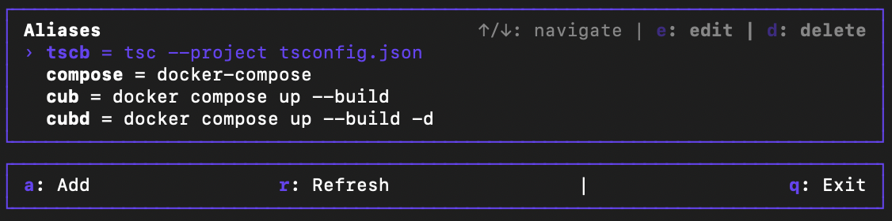
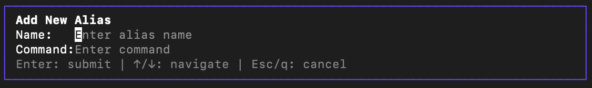
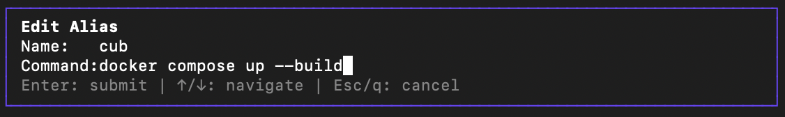

# TUI Alias Manager

A terminal user interface application for managing ZSH aliases. This tool allows you to view, add, edit, and remove aliases easier.

## Features

- View all your ZSH aliases in a clean, interactive interface
- Add new aliases with a simple form
- Edit existing aliases
- Remove aliases you no longer need
- Keyboard-driven interface for quick navigation

## Screenshots







## Installation

```bash
# Install globally using npm
npm install -g alias-manager-tui

# Or using pnpm
pnpm add -g alias-manager-tui

# Or using yarn
yarn global add alias-manager-tui
```

## Usage

Simply run the command in your terminal:

```bash
alias-manager
```

### Keyboard Controls

- **↑/↓**: Navigate through the list of aliases
- **a**: Add a new alias
- **e**: Edit the selected alias
- **d**: Delete the selected alias
- **r**: Refresh the list of aliases
- **Enter**: Submit forms / Move between form fields
- **Esc**: Cancel / Close modals

## Development

### Prerequisites

- Node.js (v16 or later)
- pnpm, npm, or yarn

### Setup

```bash
# Clone the repository
git clone https://github.com/yourusername/alias-manager-tui.git
cd alias-manager

# Install dependencies
pnpm install

# Build the project
pnpm build

# Run
pnpm start
```

### Project Structure

- `src/index.ts`: Main entry point
- `src/ui/`: UI components
- `src/services/`: Business logic services

## License

MIT
